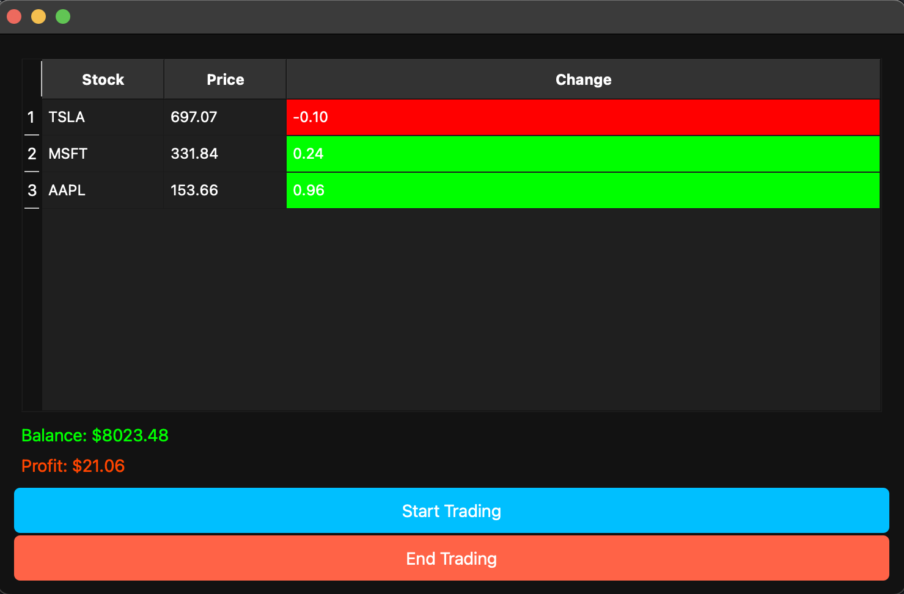
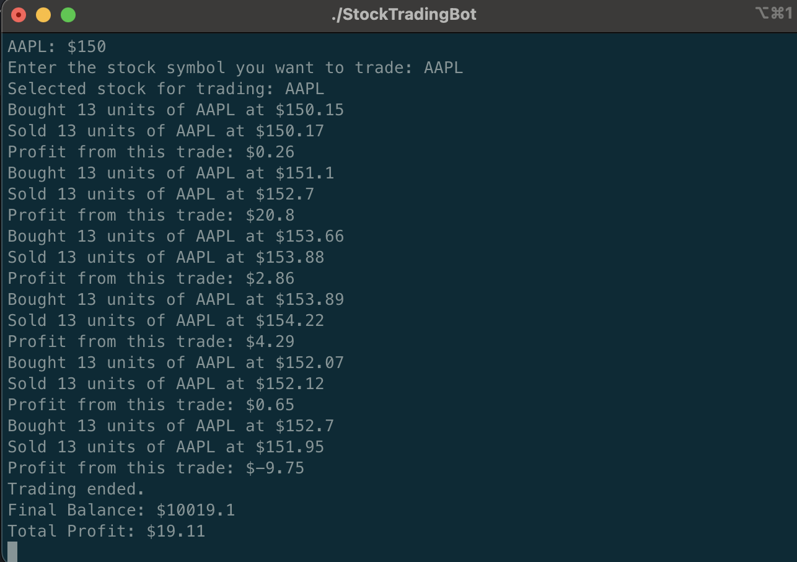

# Stock Trading Bot 🏦📈

Welcome to the **Stock Trading Bot** project! This application uses a simple yet powerful trading algorithm to simulate stock trading using market price fluctuations. It provides an interactive graphical user interface (GUI) for users to monitor their trades, profits, and balances in real-time.

---

## Features 🌟

- **Automated Trading**: The bot simulates stock trading, automatically buying and selling based on momentum indicators.
- **Real-time Price Simulation**: The market prices fluctuate in real-time, making the trading experience dynamic.
- **Interactive GUI**: The user interface provides real-time updates on stock prices, portfolio status, balance, and profit.
- **End Trading**: Stop trading at any time and view the total balance and profit.
- **Stock Portfolio Management**: Keep track of the number of units you own for each stock in the portfolio.

---

## 🖼️ Screenshots

  <!-- Add your image here -->
  <!-- Add your image here -->

---

## 💻 Requirements

To run this project, you need the following:

- **C++ Compiler**: Any standard C++ compiler that supports C++11 or later.
- **Qt 5.15 or higher**: For GUI development. Make sure to install Qt if you don't have it.
- **CMake**: To build the project.

---

## 🚀 How to Build and Run the Project

### 1. Clone the Repository

```bash
git clone https://github.com/your-username/StockTradingBot.git
cd StockTradingBot
```

### 2. Install Dependencies

Make sure you have **Qt** and **CMake** installed on your machine. You can download Qt from [here](https://www.qt.io/download) and install CMake from [here](https://cmake.org/download/).

- For **Qt** installation, follow the instructions for your specific operating system.
- For **CMake**, follow the instructions provided in the CMake documentation.

### 3. Build the Project

After cloning the repository and installing the necessary dependencies, create a build directory and run CMake to generate the build files. Open a terminal and run the following commands:

```bash
mkdir build
cd build
cmake ..
make
./StockTradingBot
```
